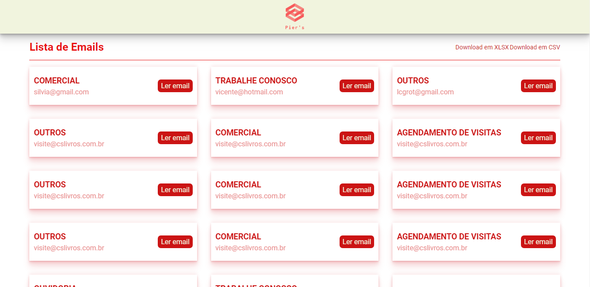
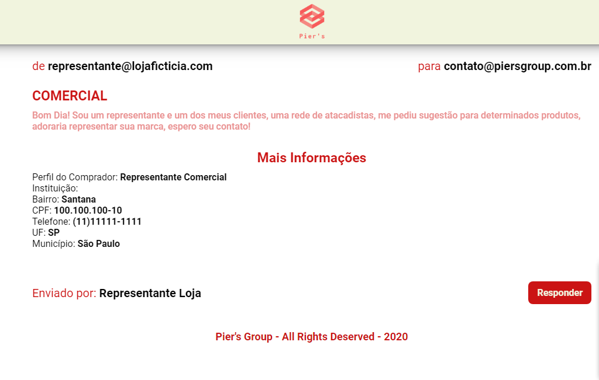

# Email Manager

### Project where you can see a list of emails from a database, read them or download in 2 types, XLSX or CSV

<p>
  
  <a href="#" target="_blank">
    
  </a>
  <a href="https://twitter.com/Lucianompjr" target="_blank">
    
  </a>
</p>

# Usage Front-End

First Install the components with

```
npm install
# or
yarn add

```

Then run with

```
npm start
# or
yarn start

```

# Usage Back-End

First install the dependencies with

```
npm install
# or
yarn add
```

Then run with

```
npm run dev
# or
yarn dev
```

# Screenshots



